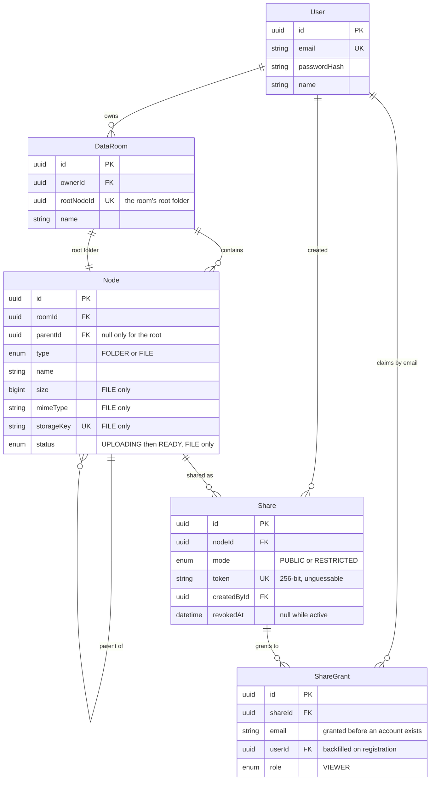

# Data Room

A due diligence data room: folders, PDF files, upload with progress, an in-browser
viewer, rename/move/delete, and sharing by public link or per-person access grants.

## Live demo

| | |
|---|---|
| Web | https://data-room-mvp-web.vercel.app |
| API | https://dataroom-api-7uax.onrender.com |
| API reference | https://dataroom-api-7uax.onrender.com/docs |
| Demo account | `demo@dataroom.app` / `Demo1234!` |

The demo account starts with a small folder tree and four sample PDFs.

**The first request may take up to a minute.** The API runs on Render's free
tier, which stops the container after fifteen minutes of inactivity and cold
starts it on the next request. Everything is quick once it is awake.

## Features

Everything listed here is implemented and reachable from the UI.

**Documents**
- Nested folders, created and renamed inline, with case-insensitive uniqueness
  enforced per folder
- PDF upload by drag-and-drop or file picker, uploaded straight to object
  storage with per-file progress, retry, and a queue that survives navigation
- Uploading a name that already exists asks whether to keep both, which
  suffixes (`report.pdf` → `report (1).pdf`), or to replace the file and keep
  the old copy in its history
- Move by drag-and-drop onto a folder row or the row that leads back up, or
  through a lazily expanded folder picker; a name clash is answered in place by
  "Keep both"
- Delete with a confirmation that states exactly what goes: how many folders and
  files, and how much data
- Tick rows (shift-click for a range, or the header box for everything listed)
  to move or delete them together; dragging any ticked row carries the whole
  selection. A batch is one transaction, so a name clash in the target leaves
  every item where it was and offers "Keep both" for all of them at once
- In-browser PDF viewer with version history, plus an escape hatch to open in a
  new tab
- Download, from the viewer or straight from a row. Downloading while looking at
  an older version saves that version, named `report (v2).pdf`
- Search by name across the whole data room, each result showing its path
- Cursor-paginated listings, folders before files, then by name
- Any level of the trail can be peeked at from the breadcrumbs without
  navigating there

**Sharing**
- Share the whole data room, any folder, or a single file
- Public links: anyone holding the link can view, no account needed
- Per-person grants by email address, which work even if the recipient has no
  account yet and resolve the moment they register
- An optional expiry — 7, 30 or 90 days — enforced at read time, so a link
  stops working the moment it is due whether or not anything has swept for it
- A "Shared with me" view of everything other people have shared, and a
  "Shared by me" view of every link you have handed out, with its path, who
  can see it, when it lapses, and a way to withdraw it
- Revoke, after which the link answers 410 and the visitor sees a plain
  explanation rather than a broken page — including the visitor who already had
  it open, since the share view re-checks the token while it is on screen
- Every shared view is strictly read-only: mutation controls are absent, not
  disabled. Downloading is not a mutation, so recipients can save what they
  were sent

**Accounts and interface**
- Email/password with argon2id, JWT in an httpOnly cookie, rate-limited auth
  endpoints
- Rename the data room itself — the room row and its root folder move together,
  since they are one thing to anyone looking at the trail
- Light and dark themes, following the system until told otherwise
- Usable on a phone: labels fold back to their icons rather than pushing the
  page sideways
- An OpenAPI reference at `/docs`, generated from the same schemas that
  validate the requests

## Setup locally

Prerequisites: Node 22+, [pnpm](https://pnpm.io) (`corepack enable`), and a free
[Supabase](https://supabase.com) project, which provides both the database and
the file storage.

In the Supabase project, before starting:

1. **Storage** → create a bucket named `dataroom-dev`, with **Public disabled**.
2. **Connect** → **ORMs** → **Prisma** → copy `DATABASE_URL` and `DIRECT_URL`.
3. **Project Settings** → **API Keys** → copy the project URL and the **secret**
   key. The publishable key cannot sign uploads for a private bucket.

```bash
# 1. Install dependencies
pnpm install

# 2. Copy env files and fill in the values above (see the comments in each file)
cp apps/api/.env.example apps/api/.env
cp apps/web/.env.example apps/web/.env.local

# 3. Create the schema and load demo data
pnpm --filter api db:migrate
pnpm --filter api db:seed

# 4. Run both apps
pnpm dev
```

Prefer a local database? `docker compose up -d` starts Postgres 16 on port 5432;
point both `DATABASE_URL` and `DIRECT_URL` at it (the commented-out lines in
`.env.example`). Storage still needs the Supabase bucket either way.

- Web: http://localhost:3000
- API: http://localhost:4000, reached from the browser through `/api/*`

### Checks

```bash
pnpm typecheck && pnpm lint && pnpm build   # must all pass
pnpm test                                   # unit tests (Vitest)
pnpm test:e2e                               # end-to-end smoke run (Playwright)
pnpm --filter api counters:check            # folder totals still match the tree
```

## Data model



Two indexes exist only in SQL, because Prisma's schema language cannot express a
functional index. Both live in the init migration:

```sql
-- "Report.pdf" and "report.pdf" cannot coexist in one folder.
CREATE UNIQUE INDEX node_parent_name_ci ON "Node" ("parentId", lower(name));

-- Covers the children listing exactly: folders first, then name, then id.
CREATE INDEX node_children_listing ON "Node" ("parentId",
  (CASE WHEN "type" = 'FOLDER' THEN 0 ELSE 1 END), lower(name), id);
```

## Design decisions

### Adjacency list plus recursive CTEs, not a closure table

Every node stores only its `parentId`. Ancestor and descendant questions are
answered by recursive CTEs, which the queries in `NodeQueriesService`,
`NodesService` and `AccessService` use for breadcrumbs, delete previews, move
cycle checks and share-subtree containment.

The alternative was a **closure table** (a row per ancestor-descendant pair) or a
**materialized path** (a `/a/b/c` string on each node). Both make subtree reads
cheaper; both make writes worse in the way this product actually writes:

| | adjacency list | closure table | materialized path |
|---|---|---|---|
| Move a folder | one `UPDATE` | delete and reinsert every pair in the subtree | rewrite the path of every descendant |
| Rename a folder | one `UPDATE` | one `UPDATE` | rewrite the path of every descendant |
| Read a subtree | recursive CTE | one indexed join | one `LIKE 'prefix%'` |
| Referential integrity | enforced by the FK | maintained by trigger or application code | none - paths can go stale |

A data room is read-often and write-rarely, but its writes are exactly the
expensive ones for the alternatives: moving and renaming folders. The adjacency
list keeps those O(1), keeps the delete cascade a schema-level guarantee rather
than application bookkeeping, and makes it impossible for the tree to become
internally inconsistent. Recursive CTEs are cheap at this depth and, crucially,
can be swapped for denormalized counters later without changing the shape of the
data (see "How it scales").

### Every room has a root folder

A `DataRoom` creates its root `Node` in the same transaction, so `parentId` is
null for exactly one node per room and non-null everywhere else. That is what
lets `node_parent_name_ci` work at all: Postgres treats NULLs as distinct in a
unique index, so if top-level nodes had a null parent, duplicate names would slip
through precisely where the tree is most visible. It also turns "is this the
root?" into a null check instead of a flag that could disagree with reality, and
gives sharing a uniform target - a room, a folder and a file are all just nodes.

### Files never pass through the API

Upload is a three-step handshake: the API reserves a `Node` and returns a signed
URL, the browser `PUT`s the bytes straight to storage, and a second call
confirms the upload. A 50 MB file therefore costs the API two small JSON
requests instead of occupying a request handler for the length of the transfer -
which matters on a free-tier host with a handful of workers.

It also keeps the failure modes honest. A node stays `UPLOADING` and stays out
of every listing until the server has read the object's real size and content
type back from storage, so an interrupted upload can never surface as a
zero-byte document. The bucket is private; every read is a signed URL valid for
ten minutes.

`XMLHttpRequest` rather than `fetch` for the upload itself, because only XHR
reports upload progress.

### Same-origin API via a Next.js rewrite, not CORS

`next.config.ts` proxies `/api/*` to the NestJS server, so the browser only ever
talks to one origin. The session cookie can then be `SameSite=Lax` with no CORS
configuration and no cross-site cookie caveats, and the usual CSRF surface closes
with it. In production the two apps are deployed separately and the rewrite
points at the API's public URL - the browser is none the wiser.

### One place decides access

`AccessService` answers every "may this user touch this node?" question; no
controller hand-rolls its own check. Two rules matter more than the rest:

- A node owned by someone else answers **404, never 403**. A 403 would confirm
  that an id exists, which is exactly what unguessable ids are for.
- A dead share link answers **410 for every reason** - revoked, expired, deleted,
  or never real - because distinguishing them would confirm that a token was
  once valid. Expiry is a comparison at read time rather than a column some job
  flips, so a link dies on schedule even if nothing has run.
- A batch is checked as a unit: one id the caller does not own fails all of it,
  with the same 404. Acting on the rest would let someone probe for other
  people's ids by watching which part of a batch survived.

Share tokens are 32 random bytes rather than the schema's cuid2 default. A link
is a bearer credential pasted into emails and chat, and cuid2's ~124 bits sits
just under the bar; 256 bits puts it out of reach entirely.

### Keyset pagination

Listings page by a `(folder-rank, lower(name), id)` tuple comparison rather than
`OFFSET`, and the cursor carries the sort keys Postgres itself computed. Page 200
costs what page 1 costs, and a file uploaded mid-scroll cannot shift the window
and cause a skipped or repeated row. Re-deriving the sort key in JavaScript would
risk disagreeing with Postgres's collation, so the server never does.

## How it scales

### Counting and sizing a subtree

Both answers are in the code, because the two are needed for different things.

**A recursive CTE** computes it from the tree, in a single round trip whatever
the depth. This is what the delete confirmation uses: it states how much is
about to be destroyed, and that number has to be derived from the truth rather
than from something that might have drifted.

**Running totals on each node** (`subtreeBytes`, `subtreeFiles`,
`subtreeFolders`) are what the listing uses, because showing a size for every
folder row would otherwise be a recursive query per row. They are maintained by
`SubtreeCountersService`, which walks the ancestor chain - O(depth), bounded in
practice - inside the same transaction as the change that caused them to move.
That is what makes an upload that fails, or a move rejected for a name clash,
leave the totals exactly as they were. The arithmetic is `SET x = x + delta` in
SQL rather than read-modify-write in the application, so two uploads into one
folder serialise on the row lock and both land.

The cost of denormalizing is that a counter is only correct while every write
path maintains it, and there are six: publishing an upload, replacing a file
with a new version, creating a folder, moving, deleting, and the seed. Miss one
and the number drifts silently and permanently. So the counters are not the
interesting part - the reconciliation is. `pnpm --filter api counters:check`
recomputes every node from the tree and reports anything that disagrees;
`rebuildSubtreeCounters` repairs it. That check is how the counters are tested,
and in production it is what a nightly job would run.

Bulk operations adjust each chain once for the whole batch rather than once per
item, which is sound because the deltas add: a selection is one folder's worth
of siblings, and they share every ancestor above it. That shortcut is also the
reason `POST /nodes/move` and `POST /nodes/delete` refuse a selection holding
both a folder and something inside it - the inner item's bytes are already
counted inside the outer one's totals, so adding both would count them twice.
No UI can produce such a selection, since ticking happens within one listing,
but the rule is enforced rather than assumed.

A **closure table** is the other way to make subtree aggregates cheap - one
indexed scan, no drift - but it rewrites a row per ancestor-descendant pair on
every move, and moving folders is a first-class operation here.

### 100,000 files in one room

Most of what this needs is already in place:

- **Keyset pagination** with the covering `node_children_listing` index, so deep
  pages cost what shallow ones cost
- **Case-insensitive uniqueness** enforced by the index rather than by scanning
  siblings
- **Server-side search**, because scrolling stops being a way to find anything.
  It matches anywhere in the name, which a btree cannot help with at all - only
  anchored prefixes - so a trigram GIN index on `lower(name)` backs it.

What would need to change:

- **List virtualization** on the client. The table renders every loaded row; past
  a few thousand it needs windowing (`@tanstack/virtual`) so the DOM stays small.
- **Bounded recursion**. A deliberately deep tree makes recursive CTEs expensive;
  a depth cap on folder creation, or a `WHERE depth < n` guard in the CTEs, keeps
  the cost predictable.
- **Name resolution on upload** currently reads the sibling names that could
  collide. In a folder with tens of thousands of near-identical names that read
  grows; a dedicated index or a different suffixing strategy would take over.

### Viewer and editor roles

`ShareRole` is already an enum, and `ShareGrant` already carries a role per
grant. Only `VIEWER` is implemented and only `VIEWER` is offered in the UI - the
enum exists so that adding `EDITOR` is a permission-map change rather than a
schema migration.

Concretely: add `EDITOR` to the enum, give `AccessService` a capability map
(`VIEWER → [read]`, `EDITOR → [read, write]`), and have the mutating endpoints
ask it for permission instead of calling `requireOwnedNode`. The public
controller and the read-only browser stay as they are; the shared `FileBrowser`
already takes its row actions as a prop, so an editor's view is the same
component with actions passed in.

## Testing

- **Vitest** covers the places where a mistake would be quiet rather than loud:
  the suffixing rules that decide what an uploaded file ends up called, the
  access matrix behind every share link, and the subtree delta arithmetic that
  lets a bulk operation adjust a folder once instead of once per item. Each
  constructs its subject directly with a stubbed client, so the suite needs no
  database. The counters themselves are checked against the tree by
  `counters:check` rather than by a unit test - see above.
- **Playwright** covers the one path that has to work end to end: register,
  create a folder, upload, rename, share, open the link from a second browser
  context as an outsider would, revoke, and confirm the link is closed off.
  `E2E_BASE_URL=https://… pnpm test:e2e` runs the same pass against a
  deployment instead of a local stack.

## AI usage

I built this with Claude Code, and used it the way I would use a fast engineer
who has never seen the product before: I decided what to build and how the data
should be shaped, it wrote most of the code, and I kept the means of checking it
in my own hands.

**What I decided.** The data model, and the trade-offs behind it: an adjacency
list with recursive CTEs rather than a closure table, because folders move often
here and a closure table rewrites a row per ancestor-descendant pair on every
move. Keyset pagination instead of `OFFSET`. Uploads going straight to storage
so file bytes never pass through the API. 404-never-403 for a node you do not
own, and a single 410 for every kind of dead link. Denormalised folder totals
maintained inside the transaction that changes them *and* a reconciliation
script, rather than either on its own. And every product call: that a name
clash offers "keep both" instead of refusing, that dragging a ticked row takes
the whole selection with it, that the delete confirmation states real numbers,
that the delete preview keeps reading the tree even though a faster number sits
right there - and what to leave out when the time ran short.

**What the model wrote.** Most of the implementation, the recursive SQL, the
Vitest and Playwright suites, and the first draft of this README. It is quick at
the part that is typing and consistent detail, and genuinely good at SQL I would
otherwise have written slowly.

**What made it trustworthy.** Not review by reading - review by running. Nothing
counted as done until `typecheck && lint && build && test` passed, and every
feature was driven in a real browser rather than trusted from the diff. Some of
what that caught:

- `counters:check` recomputes every folder's totals from the tree and compares
  them with the stored ones. It found drift the first time it ran: the seed
  writes rows directly, so it bypassed the service that maintains them.
- Sorting by size would have silently dropped every folder from page two.
  Folders have no size, and a `NULL` inside a tuple comparison is never true.
  Paging every sort and direction through a mixed folder is what surfaced it.
- The entire app rendered in Times New Roman for a while, because a CSS variable
  had been defined in terms of itself and resolved to nothing. The code read
  correctly; only measuring the computed style showed it.
- Renaming the data room appeared to work and changed nothing on screen: the
  room and its root folder are one thing to a reader and two rows underneath.
  Clicking through it is what showed the trail had not moved.
- A Vercel deploy failed because a hook that reads the query string had no
  Suspense boundary - something only the production build catches. It got
  through because I had let `build` slip out of that gate for a few rounds.

That last one is the honest summary of the experience. The model is fast and
usually right, and neither of those is the same as correct. The work that
mattered was deciding what to build, and keeping a harness that could tell me
when it had not been.

## What I'd do next

- **Content verification on upload.** The server checks the declared content type
  and the stored size, but not the bytes. A magic-number check, and eventually a
  virus scan, belong between upload and `READY`.
- **Scheduled cleanup.** A failed upload releases its own reservation, but a
  browser that crashes mid-upload still strands a row in `UPLOADING`. Stranded
  rows are invisible in every listing and harmless apart from holding a name, so
  nothing collects them today; a job that sweeps anything older than a day,
  along with the storage objects behind it, is the honest fix.
- **Audit log.** Due diligence turns "who opened this, and when" into a real
  question. An append-only log of views and downloads per share is the natural
  next model.
- **Editor role**, as described above.
- **Restoring an older version.** History can be read and any version viewed,
  but making an old one current again is not wired up - it is one more row and
  a pointer swap, using the machinery that is already there.
- **Search beyond names.** Matching is on file names only; extracting PDF text
  into a `tsvector` would make the contents searchable, which is what someone
  reading a data room actually wants.
